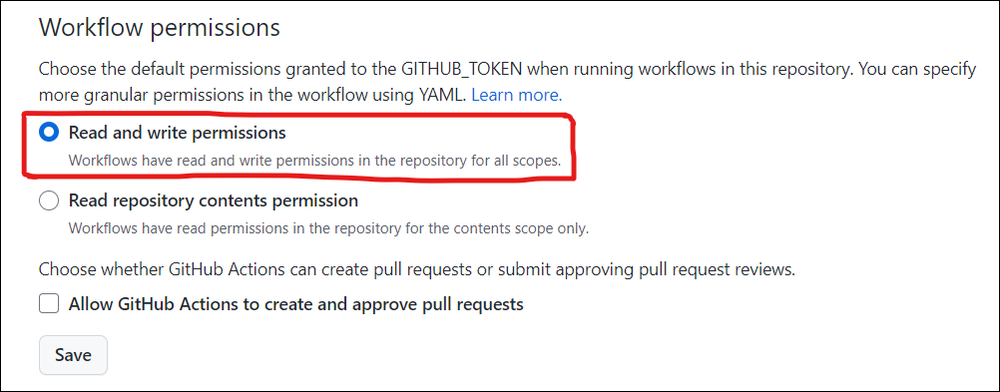
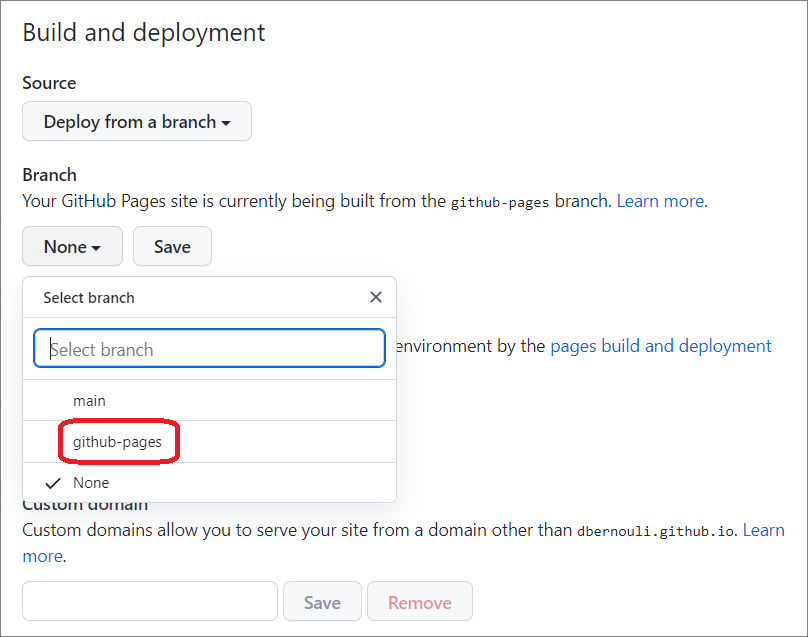

## Gradescope Google Calendar Integration

All credit goes to [@tanjeffreyz](https://github.com/tanjeffreyz) for developing the web scraping service and most of the README. 
Because some online homework platforms such as Gradescope don't have an API for students (boo👎), web scraping is required to retrieve 
information about assignments. **HTTP requests** are used alongside **Beautiful Soup** to perform this web scraping, 
which is automatically executed every 6 hours using **GitHub Actions**.


## One-time Setup Instructions
1. Log into GitHub or <a href="https://github.com/join"><b>create a new GitHub account</b></a> if you don't have one.

2. Click <a href="#"></a> at the top of this page, 
which should open the following prompt.
<div align="center">
    
</div>

3. Enter a name for the new repository. <b>I advise you to set the repository to private, otherwise your course data will be able to be publically accessed.</b> If you don't care, you can set it to public.
Then, click <b>Create Repo</b>.

4. Visit your new repository's secrets at the following link:
```
https://github.com/YOUR_USERNAME/REPOSITORY_NAME/settings/secrets/actions
```


## UNFINISHED


5. For each homework platform you use, create **two** new 
<a href="https://docs.github.com/en/actions/security-guides/encrypted-secrets">GitHub secrets</a>: 
one for your **username** and one for your **password**. A new secret can be created by clicking 
<a href="#"></a>. 
<b>For each secret's "Name" field, you must only use the values listed below.
In the "Secret" field, enter either your username or password depending on the value you chose for the "Name" field.</b>

<table align="center">
    <tr><th align="center">Username</th><th align="center">Password</th></tr>
    <tr align="center"><td>GRADESCOPE_USER</td><td>GRADESCOPE_PASSWORD</td></tr>
</table>

6. Now, go to the following link:
```
https://github.com/YOUR_USERNAME/REPOSITORY_NAME/settings/actions
```

7. Under "Workflow Permissions", make sure that "Read and write permissions" is enabled:
<div align="center">
    
</div>

8. Next, go to the following link:
```
https://github.com/YOUR_USERNAME/REPOSITORY_NAME/settings/pages
```

9. In the dropdown menu under "Branch", select "github-pages" and click
<a href="#"></a>:
<div align="center">
    
</div>

10. Lastly, using the file navigation in your repository's home page, go to `data/assignments.js`, **delete** the file, and click 
<a href="#"></a>. 

<br>

That's it! <b>Planit</b> will start retrieving assignment information roughly once every hour and update your 
personal planner at the link below, which you can visit (and bookmark!) on any of your devices.
```
https://YOUR_USERNAME.github.io/REPOSITORY_NAME
```
